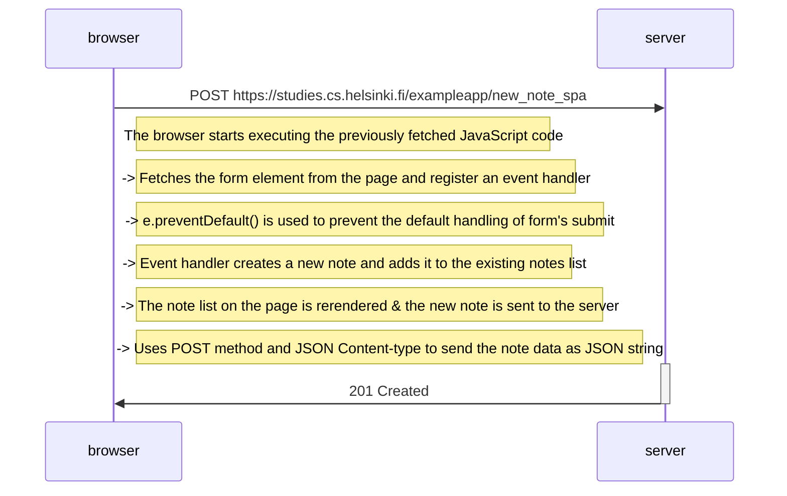

```mermaid
  sequenceDiagram
  participant browser
  participant server

  browser->>server: POST https://studies.cs.helsinki.fi/exampleapp/new_note_spa

  Note right of browser: The browser starts executing the previously fetched JavaScript code
  Note right of browser: -> Fetches the form element from the page and register an event handler
  Note right of browser: -> e.preventDefault() is used to prevent the default handling of form's submit
  Note right of browser: -> Event handler creates a new note and adds it to the existing notes list
  Note right of browser: -> The note list on the page is rerendered & the new note is sent to the server
  Note right of browser: -> Uses POST method and JSON Content-type to send the note data as JSON string

  activate server
  server->>browser: 201 Created
  deactivate server
```
